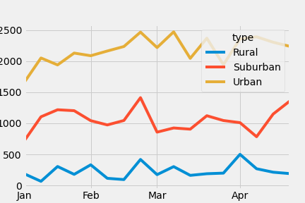

# PyBer Ride-Share Data Anaylsis 
## Overview of the analysis: 
The anaylsis was done to help PyBer improve it's access to ridesharing services and help the organization to provide affordable services to underserved areas
## Results: 
Using images from the summary DataFrame and multiple-line chart, describe the differences in ride-sharing data among the different city types.
A total of 120 cities 
Data was collected from a 120 cities with:
- 125 rides in Rural cities, 
- 625 rides in Suburban cities and 
- 1625 rides in Urban cities 

were used in this analysis

The chart below shows the relationship between the sum of fares that were paid between January and April, which each line representing the type of city.

## Summary: 

The CEO should consider making the fare more affordable for the rural cities in April because there is a increase in ridership during that same month in urban and suburban cities
